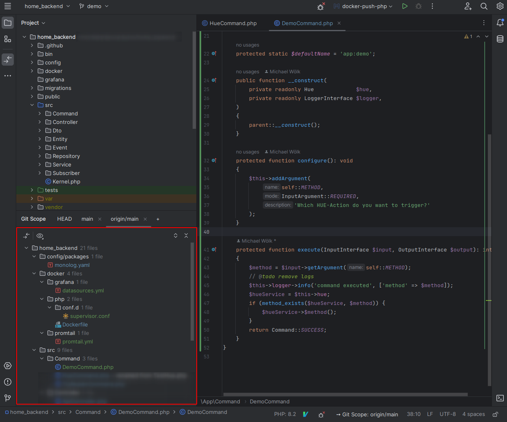
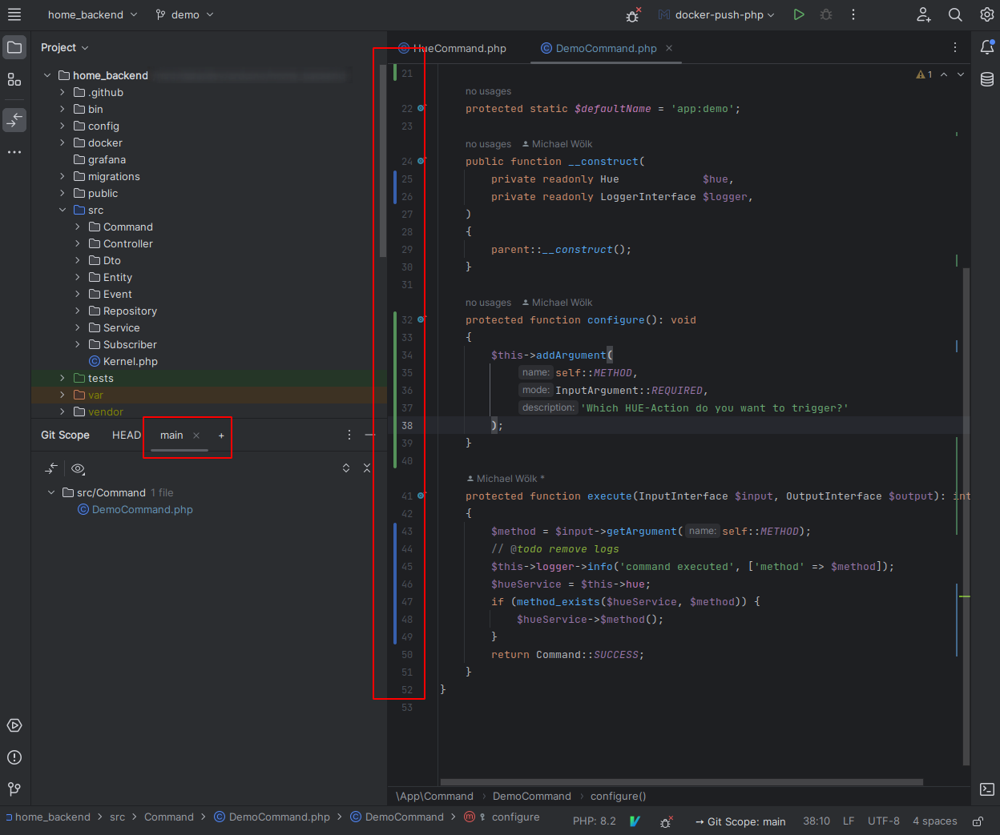
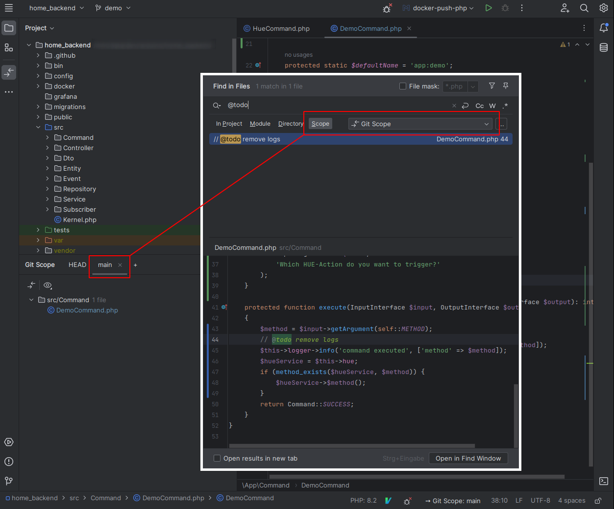
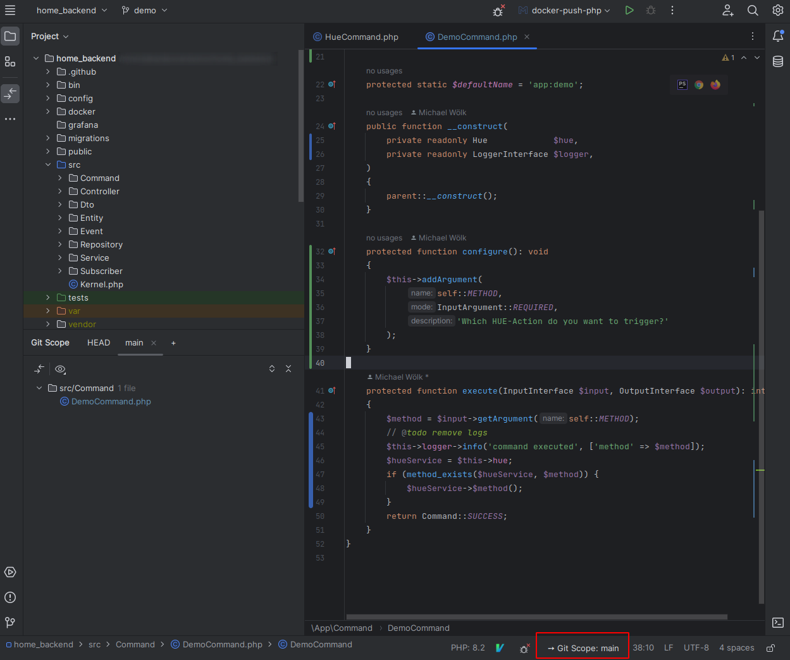

# GIT SCOPE (Intellij Plugin)
Create a custom scope based on any target branch that you can select in a tool window, which is then called **GIT SCOPE**.
This scope is then used in a tool window, as line status in the line gutter, displayed in the status bar widget
and finally as a custom scope.

## Story
I think every developer loves to check their changes with **version control** before committing.
But there is a big problem after committing the code: All changes in **version control** and also the line status disappear completely.
Usually a branch contains more than one commit. This plugin helps you to make these commits visible again in an intuitive way!

## Modifications in Detail

**Change Browser:**

Adds a tool window with a "change browser" (similar to version control) that displays the current diff of the **GIT SCOPE**.

**Line Status Gutter:**

Adjusts the line status according to your **GIT SCOPE**. Normally this built-in feature shows only the current "HEAD" changes

READ: https://www.jetbrains.com/help/phpstorm/file-status-highlights.html

**Scope:**

Adds a custom *Scope* (used to do inspections, search/replace, ect), i.e. search results are filtered by **GIT SCOPE**.

READ: https://www.jetbrains.com/help/phpstorm/scopes.html

**Status Bar Widget**

To see the current selection of the Git Scope even when the tool window is not open, you can look at the status bar widget.

## Shortcuts (Added by this Plugin)
|Shortcut| Description|
| --- |---|
| Alt+H | Toggle between HEAD and last git scope selection|

## More Useful Shortcuts
| Shortcut                                  | Description|
|-------------------------------------------|---|
| Ctrl+D (on any file in a changes browser) | Open diff window|
| F7                                        | step forward (in diff window)|
| Shift+F7                                  | step backward (in diff window)|
