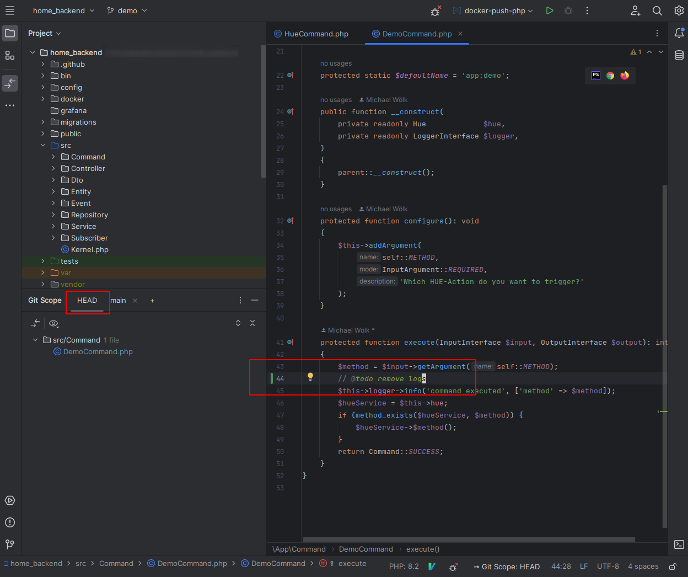

# GIT SCOPE (Intellij Plugin)
Create custom scope based on an any target branch you can choose from within a tool window which is then called **GIT SCOPE**.
This scope is then used in a tool window, line status gutter, status bar widget, and finally as a scope.

# Story
I guess every developer loves to check their changes before commit using the **Version Control**.
But there is one big problem after committing code: All changes in the **Version Control** and also the Line Status completely disappear.
Usually one branch contains more than one commit. This plugin helps you to make these commits visible again in a intuitive way!

# Modifications in Detail

**Change Browser:**

Adds a tool window with a "change browser" (similar to Version Control) which shows the current diff of your **GIT SCOPE**

**Line Status Gutter:**

Adapts the Line Status according to your **GIT SCOPE**. Usually this built-in feature shows only the current "HEAD" changes

READ: https://www.jetbrains.com/help/phpstorm/file-status-highlights.html

**Scope:**

Adds a Custom *Scope* (inspections, search/replaces, ect) "Git Scope", which means search results will be filtered according to **GIT SCOPE**

READ: https://www.jetbrains.com/help/phpstorm/scopes.html

**Status Bar Widget**

To be able to know your current git scope selection without opened tool window you can look at the status bar widget.

## Shortcuts (Added by this Plugin)
|Shortcut| Description|
| --- |---|
| Alt+H | Toggle between HEAD and last git scope selection|

## More Useful Shortcuts
| Shortcut                                  | Description|
|-------------------------------------------|---|
| Ctrl+D (on any file in a changes browser) | Open diff window|
| F7                                        | step forward (in diff window)|
| Shift+F7                                  | step backward (in diff window)|
